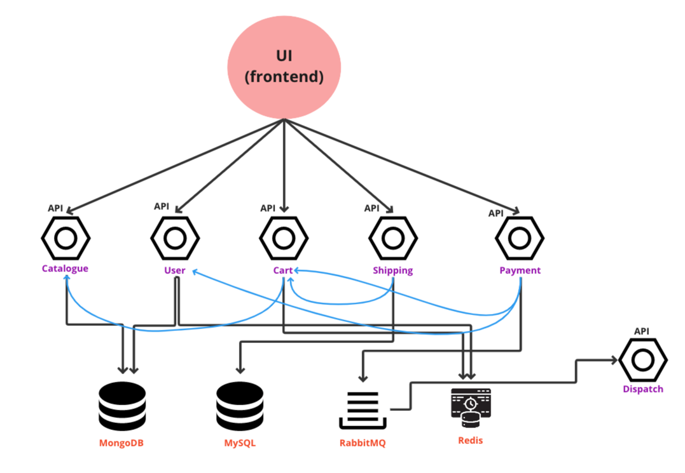

# About Stan's Robot Shop
`Stan's Robot Shop` [[GitHub Repo]](https://github.com/instana/robot-shop) was developed by IBM to demonstrate their Instana APM (Application Performance Monitoring) tool. Licensed under the Apache License 2.0, it is a sample microservices application designed to simulate an e-commerce platform selling robots and AI products. This application is built using various programming languages and frameworks, offering a comprehensive environment for exploring cloud-native technologies.

# ABout Robot-Shop-Sandbox
`Robot-Shop-Sandbox` is my customized version of `Stan's Robot Shop`, serving as a sandbox environment and personal Proof of Concept (PoC). In this project, I explore, demonstrate, and integrate cloud-native technologies and tools to showcase my skills in a real-world context. It’s more than a demo—it's an evolving testbed for hands-on skill development.

## 3-Tier Architecture Overview : 
This project follows a 3-Tier Architecture, a common design for scalable, robust applications. The architecture is divided into three distinct layers.

  
   
  <em>Figure 1: Architecture Diagram</em>

### 1. `Frontend Layer`:
- **Nginx**: The frontend service, using Nginx, handles incoming we requests and serves the UI for the application.
- **Reverse Proxy Configuration**: Set up as a reverse proxy to direct incoming traffic from the frontend to the appropriate backend services (e.g., catalogue, user). This setup enhances load distribution, security, and scalability by acting as an entry point for all API requests.
### 2. `API Layer`:
 The API layer consists of multiple microservices, each built with different languages demonstrating flexibility in microservices architectures. Services include,
- **User, Catalogue, and Cart** - `Node.js`
- **Payment** - `Python`
- **Shipping** - `Java`
- **Dispatch** - `Go`

Each service is independently deployable, allowing for flexibility and scalability based on demand.

### 3. `Data Layer`: 
The data layer includes various databases and messaging systems for handling different types of data.
- **MongoDB**: Stores product catalog data.
- **MySQL**: Likely used for relational data (e.g., user data, transactions).
- **Redis**: Acts as a caching layer, improving response times for frequently accessed data.
- **RabbitMQ**: Manages message queues for asynchronous tasks, such as notifications or order processing.

### Key Interactions:
- The Frontend Tier communicates directly with the API Tier to process user commands.
- Services within the API Tier interact with corresponding components in the Data Tier to fetch or store data.
- RabbitMQ facilitates asynchronous communication across services, managing message queues for seamless coordination.

# Project Implementation Strategy
This strategy outlines a step-by-step approach to deploying, automating, and managing the microservices in the Robot-Shop-Sandbox project. Each stage progressively builds on essential DevOps and cloud-native skills, moving from manual setups to advanced automation and container orchestration.
- `Manual Deployment`: Each service is deployed on dedicated AWS EC2 instances and integrated manually, demonstrating proficiency in Linux-based setups and service management.
- `Shell Scripting`: Deployment is automated using shell scripts to streamline service configuration and reinforce scripting expertise.
- `Configuration Management`: Ansible is used to automate deployment tasks, showcasing knowledge of configuration management best practices.
- `Infrastructure as Code (IaC)`: Terraform provisions and manages the infrastructure, demonstrating infrastructure automation skills.
- `CI/CD Pipeline`: Jenkins is used to establish a CI/CD pipeline, ensuring continuous integration and delivery.
- `Containerization and Orchestration`: Microservices are containerized and managed with Kubernetes, leveraging Helm for streamlined deployment.